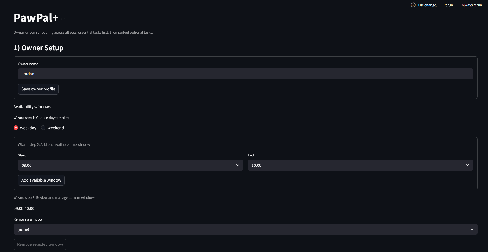
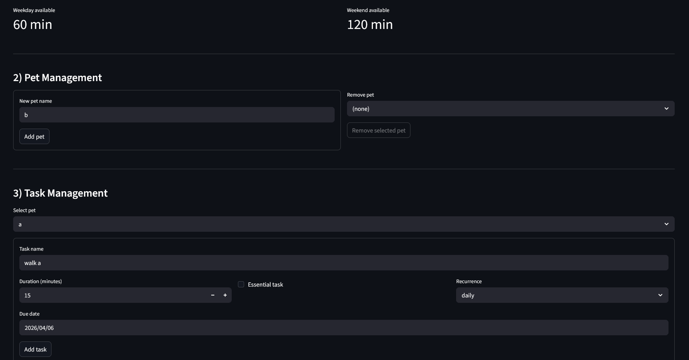
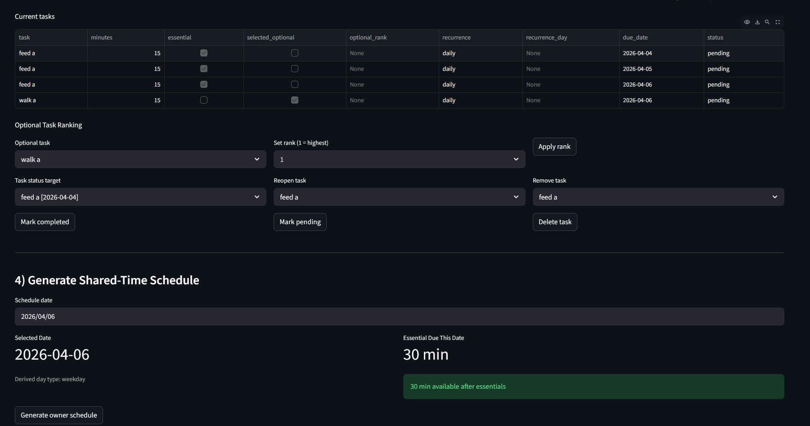
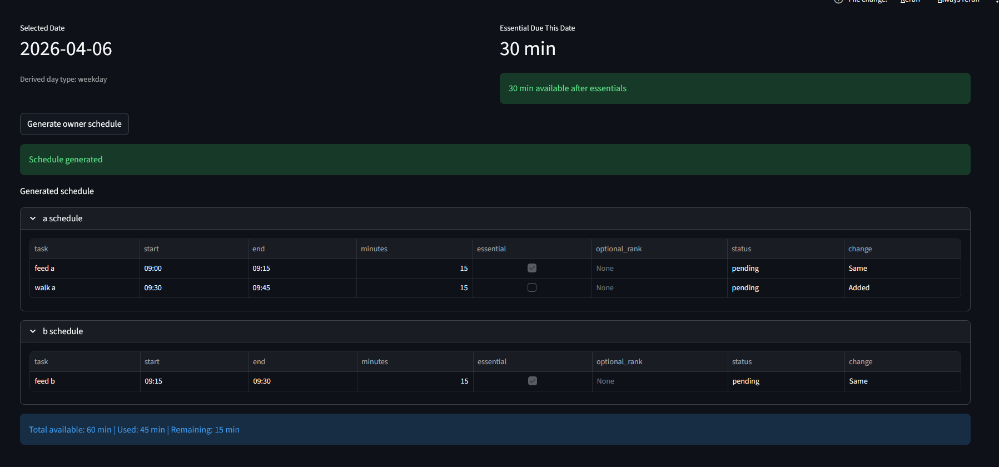
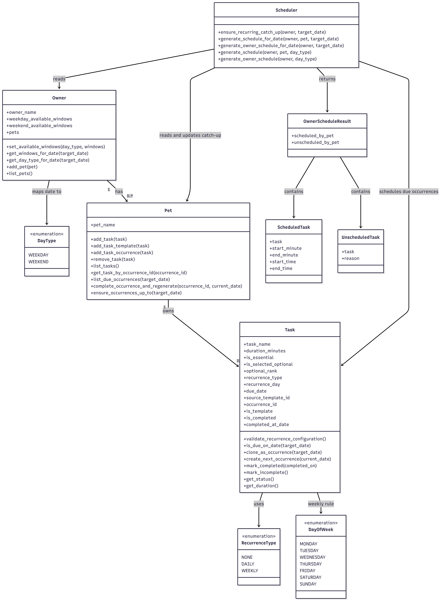

# PawPal+ (Module 2 Project)

You are building **PawPal+**, a Streamlit app that helps a pet owner plan care tasks for their pet.

## Scenario

A busy pet owner needs help staying consistent with pet care. They want an assistant that can:

- Track pet care tasks (walks, feeding, meds, enrichment, grooming, etc.)
- Consider constraints (time available, priority, owner preferences)
- Produce a daily plan and explain why it chose that plan

Your job is to design the system first (UML), then implement the logic in Python, then connect it to the Streamlit UI.

## What you will build

Your final app should:

- Let a user enter basic owner + pet info
- Let a user add/edit tasks (duration + priority at minimum)
- Generate a daily schedule/plan based on constraints and priorities
- Display the plan clearly (and ideally explain the reasoning)
- Include tests for the most important scheduling behaviors

## Features

- **Multi-Range Availability Windows**  
  Define owner availability as multiple time slots per weekday/weekend (e.g., 8–9 AM + 5–7 PM) instead of total minute budgets. Supports realistic fragmented schedules.

- **Date-Based Scheduling**  
  Generate schedules for specific calendar dates with automatic weekday/weekend classification. Supports date-scoped occurrence filtering and precise timestamp placement.

- **Daily and Weekly Recurrence**  
  Set tasks to repeat daily (`+1 day`) or weekly (`+7 days`) with configurable recurrence rules. Weekly tasks require a specific day-of-week rule.

- **Deterministic Catch-Up Materialization**  
  Automatically generate missing recurring occurrences for any skipped dates up to the selected scheduling date. Ensures consistent, idempotent schedule generation.

- **Completion-Triggered Next Occurrence**  
  Mark a recurring task as complete and automatically create the next occurrence (daily or weekly) in the system. Keeps recurring task lifecycle seamless.

- **Priority-Based Task Scheduling**  
  Schedule essential tasks first, then fill remaining time with ranked optional tasks. Ensures critical care needs are never sacrificed for optional work.

- **Optional Task Ranking**  
  Assign rank (priority) to non-essential tasks. Scheduler respects rank ordering within the optional tier, with deterministic tie-breaking by task name.

- **Multi-Pet Shared Scheduling**  
  Generate a single schedule for all pets under one owner using one shared time budget across all availability windows. Earlier pets consume available time, reducing options for later pets.

- **Contiguous Window Fitting (Earliest-Fit Allocation)**  
  Place tasks in the earliest available time window that can fit the task duration. Automatically fragments windows when tasks partially consume them.

- **Explicit Scheduling Rationale**  
  For each unscheduled task, the system reports a reason: "No available time window can fit this essential task" or "No remaining contiguous availability for optional task."

- **Timestamped Schedule Output**  
  Display scheduled tasks with explicit `start_time` and `end_time` (e.g., 8:00 AM–8:15 AM) instead of just durations. Makes schedules calendar-ready and time-aware.

- **Occurrence-Level Task Actions**  
  Reopen or delete specific recurring task occurrences by unique occurrence ID, preventing ambiguity when same-named tasks appear across multiple dates.

- **Schedule Caching**  
  Automatically cache computed schedules based on state hash (owner profile, pet tasks, recurrence metadata, selected date). Instant retrieval when no data has changed.

- **Essential Time Pre-Calculation**  
  Display total essential task duration before generating a schedule, with warnings if essential time exceeds available windows. Prevents unrealistic scheduling attempts.

- **Schedule Diff Highlighting**  
  When regenerating a schedule, visually highlight newly added tasks and removed tasks so users immediately see what changed.

## Screenshots

### App Interface

**Owner Setup**


**Task Management and Scheduling + Pet setup**


**Task View**


**Generated Schedule View**


### Architecture Diagram

The system architecture showing classes, relationships, and data flow:



## Getting started

### Setup

```bash
python -m venv .venv
source .venv/bin/activate  # Windows: .venv\Scripts\activate
pip install -r requirements.txt
```

### Testing
```bash
python -m pytest -v
```

### Suggested workflow

1. Read the scenario carefully and identify requirements and edge cases.
2. Draft a UML diagram (classes, attributes, methods, relationships).
3. Convert UML into Python class stubs (no logic yet).
4. Implement scheduling logic in small increments.
5. Add tests to verify key behaviors.
6. Connect your logic to the Streamlit UI in `app.py`.
7. Refine UML so it matches what you actually built.
