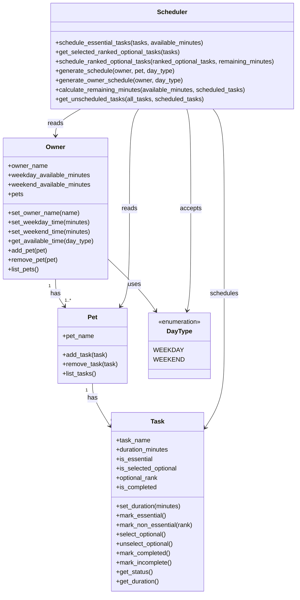

# PawPal+ Project Reflection

## 1. System Design

**a. Initial design**

My initial UML design separated the app into core data classes and one decision-making class.  
The user flow was: add a pet, define tasks with duration in minutes, mark tasks as essential or non-essential, rank non-essential tasks, enter weekday/weekend availability, and generate a realistic care plan.

- **Classes included and responsibilities**
- **Pet**: stores pet information (for example, pet name) and the list of care tasks tied to that pet.
	- Methods: `add_task(task)`, `remove_task(task)`, `list_tasks()`
- **Task**: stores each care task and its scheduling and completion metadata.
	- Data: `task_name`, `duration_minutes`, `is_essential`, `is_selected_optional`, `optional_rank`, `is_completed`
	- Methods: `set_duration(minutes)`, `mark_essential()`, `mark_non_essential(rank)`, `select_optional()`, `unselect_optional()`, `mark_completed()`, `mark_incomplete()`, `get_status()`, `get_duration()`
- **Owner**: stores owner profile, time constraints for weekdays/weekends, and pet relationships.
	- Data: `owner_name`, `weekday_available_minutes`, `weekend_available_minutes`, `pets`
	- Methods: `set_owner_name(name)`, `set_weekday_time(minutes)`, `set_weekend_time(minutes)`, `get_available_time(day_type)`, `add_pet(pet)`, `remove_pet(pet)`, `list_pets()`
- **DayType (Enum)**: standardizes accepted day categories for scheduling.
	- Values: `WEEKDAY`, `WEEKEND`
- **Scheduler**: reads `Owner`, `Pet`, and `Task` data; schedules essential tasks first, then ranked optional tasks within remaining minutes.
	- Methods: `schedule_essential_tasks(tasks, available_minutes)`, `get_selected_ranked_optional_tasks(tasks)`, `schedule_ranked_optional_tasks(ranked_optional_tasks, remaining_minutes)`, `generate_schedule(owner, pet, day_type)`, `generate_owner_schedule(owner, day_type)`, `calculate_remaining_minutes(available_minutes, scheduled_tasks)`, `get_unscheduled_tasks(all_tasks, scheduled_tasks)`

- **Initial class relationships**
- One owner can have one or more pets.
- Each pet has multiple tasks, and each task has a duration in minutes.
- The scheduler schedules all essential tasks first, then fills remaining time with ranked non-essential tasks that are marked as selected.
- Owner-level scheduling uses one shared time budget across all pets for the selected day type.
- The scheduler uses owner availability, task metadata, and task completion status for plan visibility.

**b. Design changes**

Yes. During implementation, I removed the separate `Preferences` class and moved optional-task selection and ranking into the `Task` class.

I made this change to avoid duplicating scheduling data in two places. With a separate `Preferences` object, task state could become inconsistent (for example, a task marked optional in one object but missing in another). Keeping selection and rank directly on each task created a single source of truth, simplified the scheduler input, and made the logic easier to test and explain.

I also introduced a `DayType` enum (`WEEKDAY` and `WEEKEND`) so day selection is validated consistently, and I expanded the scheduler with `generate_owner_schedule(...)` so all pets share one daily time budget. Finally, I added task completion tracking (`is_completed`) so the UI can show pending vs completed work.

---

## 2. Scheduling Logic and Tradeoffs

**a. Constraints and priorities**

The scheduler considers: owner available minutes for the selected day type, task duration, whether a task is essential, whether a non-essential task is selected, and optional rank. I prioritized constraints in this order: (1) time limit is hard, (2) essential tasks are highest priority, (3) selected optional tasks are considered only after essentials, and (4) optional rank orders non-essential tasks.

**b. Tradeoffs**

One tradeoff is that some essential tasks may remain unscheduled when the daily budget is too small, because the scheduler includes only tasks that fit in order. This is reasonable for this scenario because it keeps the plan realistic under hard time limits instead of overcommitting tasks the owner cannot complete.

---

## 3. AI Collaboration

**a. How you used AI**

- How did you use AI tools during this project (for example: design brainstorming, debugging, refactoring)?
- What kinds of prompts or questions were most helpful?

**b. Judgment and verification**

- Describe one moment where you did not accept an AI suggestion as-is.
- How did you evaluate or verify what the AI suggested?

---

## 4. Testing and Verification

**a. What you tested**

- What behaviors did you test?
- Why were these tests important?

**b. Confidence**

- How confident are you that your scheduler works correctly?
- What edge cases would you test next if you had more time?

---

## 5. Reflection

**a. What went well**

- What part of this project are you most satisfied with?

**b. What you would improve**

- If you had another iteration, what would you improve or redesign?

**c. Key takeaway**

- What is one important thing you learned about designing systems or working with AI on this project?