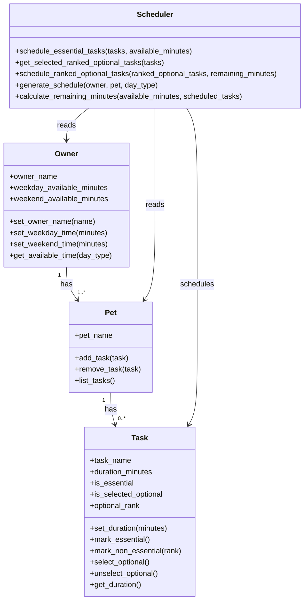

# PawPal+ Project Reflection

## 1. System Design

**a. Initial design**

My initial UML design separated the app into core data classes and one decision-making class.  
The user flow was: add a pet, define tasks with duration in minutes, mark tasks as essential or non-essential, rank non-essential tasks, enter weekday/weekend availability, and generate a realistic care plan.

- **Classes included and responsibilities**
- **Pet**: stores pet information (for example, pet name) and the list of care tasks tied to that pet.
	- Methods: `add_task(task)`, `remove_task(task)`, `list_tasks()`
- **Task**: stores each care task and its scheduling metadata.
	- Data: `task_name`, `duration_minutes`, `is_essential`, `is_selected_optional`, `optional_rank`
	- Methods: `set_duration(minutes)`, `mark_essential()`, `mark_non_essential(rank)`, `select_optional()`, `unselect_optional()`, `get_duration()`
- **Owner**: stores owner profile and time constraints for weekdays and weekends.
	- Data: `owner_name`, `weekday_available_minutes`, `weekend_available_minutes`
	- Methods: `set_owner_name(name)`, `set_weekday_time(minutes)`, `set_weekend_time(minutes)`, `get_available_time(day_type)`
- **Scheduler**: reads `Owner`, `Pet`, and `Task` data; it schedules essential tasks first, then fills remaining minutes with selected ranked non-essential tasks.
	- Methods: `schedule_essential_tasks(tasks, available_minutes)`, `get_selected_ranked_optional_tasks(tasks)`, `schedule_ranked_optional_tasks(ranked_optional_tasks, remaining_minutes)`, `generate_schedule(owner, pet, day_type)`, `calculate_remaining_minutes(available_minutes, scheduled_tasks)`

- **Initial class relationships**
- One owner can have one or more pets.
- Each pet has multiple tasks, and each task has a duration in minutes.
- The scheduler schedules all essential tasks first, then fills remaining time with ranked non-essential tasks that are marked as selected.
- The scheduler uses owner availability and task metadata to adjust which tasks are scheduled and when.

**b. Design changes**

Yes. During implementation, I removed the separate `Preferences` class and moved optional-task selection and ranking into the `Task` class.

I made this change to avoid duplicating scheduling data in two places. With a separate `Preferences` object, task state could become inconsistent (for example, a task marked optional in one object but missing in another). Keeping selection and rank directly on each task created a single source of truth, simplified the scheduler input, and made the logic easier to test and explain.

---

## 2. Scheduling Logic and Tradeoffs

**a. Constraints and priorities**

- What constraints does your scheduler consider (for example: time, priority, preferences)?
- How did you decide which constraints mattered most?

**b. Tradeoffs**

- Describe one tradeoff your scheduler makes.
- Why is that tradeoff reasonable for this scenario?

---

## 3. AI Collaboration

**a. How you used AI**

- How did you use AI tools during this project (for example: design brainstorming, debugging, refactoring)?
- What kinds of prompts or questions were most helpful?

**b. Judgment and verification**

- Describe one moment where you did not accept an AI suggestion as-is.
- How did you evaluate or verify what the AI suggested?

---

## 4. Testing and Verification

**a. What you tested**

- What behaviors did you test?
- Why were these tests important?

**b. Confidence**

- How confident are you that your scheduler works correctly?
- What edge cases would you test next if you had more time?

---

## 5. Reflection

**a. What went well**

- What part of this project are you most satisfied with?

**b. What you would improve**

- If you had another iteration, what would you improve or redesign?

**c. Key takeaway**

- What is one important thing you learned about designing systems or working with AI on this project?