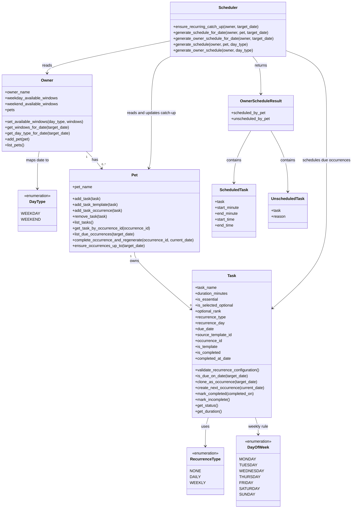

# PawPal+ Project Reflection

## 1. System Design

**a. Initial design**

My initial UML design separated the app into core data classes and one decision-making class.  
The user flow was: add a pet, define tasks with duration in minutes, mark tasks as essential or non-essential, rank non-essential tasks, enter weekday/weekend availability, and generate a realistic care plan.

- **Classes included and responsibilities (updated to final implementation)**
- **Pet**: stores pet identity and recurrence-aware task occurrences/templates.
	- Methods: `add_task(task)`, `add_task_template(task)`, `add_task_occurrence(task)`, `remove_task(task)`, `list_tasks()`, `get_task_by_name(task_name)`, `get_task_by_occurrence_id(occurrence_id)`, `list_due_occurrences(target_date)`, `complete_occurrence_and_regenerate(occurrence_id, current_date)`, `ensure_occurrences_up_to(target_date)`
- **Task**: stores care task metadata plus recurrence and occurrence lifecycle fields.
	- Data: `task_name`, `duration_minutes`, `is_essential`, `is_selected_optional`, `optional_rank`, `recurrence_type`, `recurrence_day`, `due_date`, `source_template_id`, `occurrence_id`, `is_template`, `is_completed`, `completed_at_date`
	- Methods: `validate_recurrence_configuration()`, `is_due_on_date(target_date)`, `clone_as_occurrence(target_date)`, `create_next_occurrence(current_date)`, `set_duration(minutes)`, `mark_essential()`, `mark_non_essential(rank)`, `select_optional()`, `unselect_optional()`, `mark_completed(completed_on)`, `mark_incomplete()`, `get_status()`, `get_duration()`
- **Owner**: stores owner profile, weekday/weekend availability windows, and pet relationships.
	- Data: `owner_name`, `weekday_available_windows`, `weekend_available_windows`, `pets`
	- Methods: `set_owner_name(name)`, `set_available_windows(day_type, windows)`, `add_available_window(day_type, start_minute, end_minute)`, `remove_available_window(day_type, start_minute, end_minute)`, `get_available_windows(day_type)`, `get_schedulable_windows(day_type)`, `get_day_type_for_date(target_date)`, `get_windows_for_date(target_date)`, `get_available_time(day_type)`, `add_pet(pet)`, `remove_pet(pet)`, `list_pets()`
- **Scheduler**: generates shared-time schedules with explicit timestamps, date filtering, and recurrence catch-up.
	- Methods: `ensure_recurring_catch_up(owner, target_date)`, `generate_schedule_for_date(owner, pet, target_date)`, `generate_owner_schedule_for_date(owner, target_date)`, plus legacy compatibility methods `generate_schedule(owner, pet, day_type)` and `generate_owner_schedule(owner, day_type)`
- **Enums**: `DayType` (`WEEKDAY`, `WEEKEND`), `DayOfWeek` (`MONDAY...SUNDAY`), `RecurrenceType` (`NONE`, `DAILY`, `WEEKLY`)
- **Schedule result data objects**: `ScheduledTask`, `UnscheduledTask`, `OwnerScheduleResult`

- **Updated class relationships**
- One owner can have zero or more pets.
- Each pet owns multiple task records that may represent templates or dated occurrences.
- Recurrence is defined on task metadata (`RecurrenceType` + optional `DayOfWeek`) and materialized into dated occurrences (`due_date`).
- Scheduler first ensures recurring catch-up up to `target_date`, then schedules only occurrences due on `target_date`.
- Owner-level scheduling uses one shared free-window pool across all pets, so one pet's placement reduces available time for the next.

**b. Design changes**

Yes. During implementation, I removed the separate `Preferences` class and kept optional-task selection/ranking directly on each `Task`.

I made this change to avoid duplicated state and keep one source of truth for scheduling metadata. I then replaced simple minute totals with normalized availability windows on `Owner` and changed schedule output to explicit timestamped blocks (`start_time`, `end_time`) so the plan is calendar-like instead of just a minutes list.

I also introduced a date-first recurrence model: each occurrence has a concrete `due_date`, recurring templates generate future occurrences, and completion can auto-create the next occurrence (daily `+1 day`, weekly `+7 days`). The scheduler now runs by selected date (`generate_owner_schedule_for_date(...)`) and applies recurrence catch-up before scheduling due occurrences across all pets using one shared free-window pool.

---

## 2. Scheduling Logic and Tradeoffs

**a. Constraints and priorities**

The scheduler considers: owner availability windows for the selected date, task duration, whether a due occurrence is essential, whether a non-essential occurrence is selected, optional rank, and recurrence date rules. I prioritized constraints in this order: (1) time windows are hard limits, (2) only occurrences due on the selected date are eligible, (3) essential occurrences are highest priority, (4) selected optional occurrences are considered after essentials, and (5) optional rank orders non-essential occurrences.

**b. Tradeoffs**

One tradeoff is that some essential occurrences may still remain unscheduled when no free window can fit their duration. This is reasonable for this scenario because it keeps plans realistic and time-accurate rather than overcommitting impossible blocks. Another tradeoff is multi-pet sequencing: because pets consume a shared free-window pool in order, earlier pets can reduce options for later pets on the same date.

---

## 3. AI Collaboration

**a. How you used AI**

I used AI extensively across all phases of the project:

- **Design Brainstorming**: Asked for ideation on how to move from scalar minute budgets to multi-range availability windows. The AI helped identify which functions would need rewriting and outlined the scope of impact.
- **Natural-Language Specifications**: Created two detailed revamp design documents (SCHEDULER_REVAMP.md and DAILY/WEEKLY_SCHEDULE_REVAMP.md) without code, describing the new architecture, data model, and behavior before implementation.
- **Iterative Implementation**: Asked the AI to implement revamps in code, then iteratively refined edge cases (e.g., recurrence catch-up behavior, date-first modeling, occurrence-level actions for disambiguation).
- **Conceptual Clarification**: Asked questions about ambiguous system behavior (e.g., "What happens when a weekly task is skipped for two weeks?" or "How should multi-pet scheduling work with shared windows?") and got detailed explanations that informed the implementation.
- **Test Expansion**: Requested comprehensive test suites for recurrence logic, sorting behavior, and edge cases. The AI generated test cases with descriptive one-sentence docstrings that covered critical behaviors.
- **Documentation Alignment**: Updated changelog, reflection.md UML diagram, and README Features list to match the final implementation without manual alignment errors.

The most helpful prompts were those that clearly stated a design constraint or asked "what should happen when..." because they forced explicit decision-making rather than accepting defaults.

**b. Judgment and verification**

One critical moment: when drafting the scheduler revamp, the AI initially suggested supporting both "available windows" and "blocked windows" (unavailable times). I rejected this and clarified we only need available windows, because:
- The UI would be more confusing (two input modes)
- Blocked windows can always be modeled as the inverse of available windows
- Keeping it simple reduced implementation complexity

I verified this decision by testing the window model against real scheduling scenarios (multi-window fragmentation, multi-pet sequencing) and confirming the simpler model still solved the original problem.

Additionally, I validated all implementation changes by:
- Running the full pytest suite immediately after each major code change (expected: all tests pass)
- Manually testing the Streamlit UI to confirm state management and recurrence behavior matched the spec docs
- Checking that new test cases exercise edge cases (catch-up idempotency, same-name task disambiguation, weekend mapping) rather than just happy paths

---

## 4. Testing and Verification

**a. What you tested**

I tested core scheduling behaviors across two test suites (30 total tests, all passing):

- **Priority & ranking**: Essential tasks schedule before optionals; ranked optionals respect rank ordering with deterministic tie-breaking by name.
- **Window fitting**: Tasks fit into earliest available contiguous window; windows fragment correctly; unscheduled tasks report specific reasons.
- **Recurrence logic**: Daily tasks regenerate with `+1 day`; weekly tasks with `+7 days`; invalid recurrence configs are caught.
- **Catch-up materialization**: Missing occurrences are generated deterministically up to target date; re-running catch-up is idempotent.
- **Date filtering**: Only occurrences due on the selected date are scheduled; occurrence ID prevents same-name task ambiguity.
- **Multi-pet sequencing**: First pet's tasks consume windows; later pets have reduced availability; scheduling is deterministic given same input.
- **Weekend/weekday mapping**: Correct day-type is selected for given date; window selection matches day type.

These tests were critical because they cover the core algorithmic guarantees: under time pressure, the scheduler must prioritize essentials consistently, never overcommit windows, and handle recurring occurrences predictably.

**b. Confidence**

**Confidence: 4/5**

I'm highly confident the scheduler works correctly for the implemented feature set. The algorithm is straightforward (essentials first, then ranked optionals in earliest-fit order), all critical behaviors have explicit tests, and the pytest suite passes cleanly.

Minor gaps:
- No tests for very large (1000+ task) workloads; performance under scale is untested.
- No tests for owner/window data serialization/deserialization; if data breaks, the app could fail silently.
- Daylight savings time transitions and non-US timezones are not tested (though the system uses minutes from midnight, so likely robust).

Next edge cases to test if time allowed:
- Manually deleting all occurrences of a recurring task and confirming no phantom regenerations.
- Owner switching between two completely different availability profiles and ensuring schedule recalculates correctly.
- Adding a task with 0-minute duration (should probably be rejected or handled gracefully).
- Completing a weekly task, then modifying its recurrence rule; ensuring the regenerated occurrence respects the new rule.

---

## 5. Reflection

**a. What went well**

- What part of this project are you most satisfied with?

I am satisfied with the backend functionalities that were built to be in line with the original vision as well as the meticulous process I followed to ensure that the app is update in an interative way without breaking previous functionalities. While keeping the original vision in mind, I continuously asked the AI how features can be implemented in a non-destructive manner while constantly assessing what features would need rewriting or which ones would be impacted. After the assessment, the AI drafted key areas that would be impacted and would need rewriting, which steamlined the process for the actual commmand and helped me understand how the overall functionality of the app would be impacted.

**b. What you would improve**

- If you had another iteration, what would you improve or redesign?
I would improve the design of the UI. Currently, the UI contains bare-bones components that aren't necessarily appealing to look at. Additionally, there are components that would better served when reorganized to create a better flow for the user interactions.

**c. Key takeaway**

- What is one important thing you learned about designing systems or working with AI on this project?
I learned that it is critical to create outline or planning documents so that the AI can relaibly reference changes being made and what systems would be affected so that I can more confidently press the AI to push those changes. It is also important to continously update the testing suite so that it is consistent with the newly implemented features. This also makes it very important to run the regression tests so that the old features do not break!