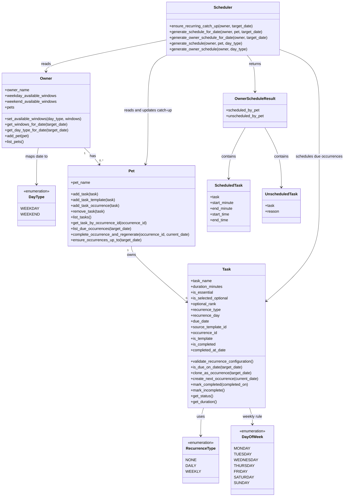

# PawPal+ Project Reflection

## 1. System Design

**a. Initial design**

My initial UML design separated the app into core data classes and one decision-making class.  
The user flow was: add a pet, define tasks with duration in minutes, mark tasks as essential or non-essential, rank non-essential tasks, enter weekday/weekend availability, and generate a realistic care plan.

- **Classes included and responsibilities (updated to final implementation)**
- **Pet**: stores pet identity and recurrence-aware task occurrences/templates.
	- Methods: `add_task(task)`, `add_task_template(task)`, `add_task_occurrence(task)`, `remove_task(task)`, `list_tasks()`, `get_task_by_name(task_name)`, `get_task_by_occurrence_id(occurrence_id)`, `list_due_occurrences(target_date)`, `complete_occurrence_and_regenerate(occurrence_id, current_date)`, `ensure_occurrences_up_to(target_date)`
- **Task**: stores care task metadata plus recurrence and occurrence lifecycle fields.
	- Data: `task_name`, `duration_minutes`, `is_essential`, `is_selected_optional`, `optional_rank`, `recurrence_type`, `recurrence_day`, `due_date`, `source_template_id`, `occurrence_id`, `is_template`, `is_completed`, `completed_at_date`
	- Methods: `validate_recurrence_configuration()`, `is_due_on_date(target_date)`, `clone_as_occurrence(target_date)`, `create_next_occurrence(current_date)`, `set_duration(minutes)`, `mark_essential()`, `mark_non_essential(rank)`, `select_optional()`, `unselect_optional()`, `mark_completed(completed_on)`, `mark_incomplete()`, `get_status()`, `get_duration()`
- **Owner**: stores owner profile, weekday/weekend availability windows, and pet relationships.
	- Data: `owner_name`, `weekday_available_windows`, `weekend_available_windows`, `pets`
	- Methods: `set_owner_name(name)`, `set_available_windows(day_type, windows)`, `add_available_window(day_type, start_minute, end_minute)`, `remove_available_window(day_type, start_minute, end_minute)`, `get_available_windows(day_type)`, `get_schedulable_windows(day_type)`, `get_day_type_for_date(target_date)`, `get_windows_for_date(target_date)`, `get_available_time(day_type)`, `add_pet(pet)`, `remove_pet(pet)`, `list_pets()`
- **Scheduler**: generates shared-time schedules with explicit timestamps, date filtering, and recurrence catch-up.
	- Methods: `ensure_recurring_catch_up(owner, target_date)`, `generate_schedule_for_date(owner, pet, target_date)`, `generate_owner_schedule_for_date(owner, target_date)`, plus legacy compatibility methods `generate_schedule(owner, pet, day_type)` and `generate_owner_schedule(owner, day_type)`
- **Enums**: `DayType` (`WEEKDAY`, `WEEKEND`), `DayOfWeek` (`MONDAY...SUNDAY`), `RecurrenceType` (`NONE`, `DAILY`, `WEEKLY`)
- **Schedule result data objects**: `ScheduledTask`, `UnscheduledTask`, `OwnerScheduleResult`

- **Updated class relationships**
- One owner can have zero or more pets.
- Each pet owns multiple task records that may represent templates or dated occurrences.
- Recurrence is defined on task metadata (`RecurrenceType` + optional `DayOfWeek`) and materialized into dated occurrences (`due_date`).
- Scheduler first ensures recurring catch-up up to `target_date`, then schedules only occurrences due on `target_date`.
- Owner-level scheduling uses one shared free-window pool across all pets, so one pet's placement reduces available time for the next.

**b. Design changes**

Yes. During implementation, I removed the separate `Preferences` class and kept optional-task selection/ranking directly on each `Task`.

I made this change to avoid duplicated state and keep one source of truth for scheduling metadata. I then replaced simple minute totals with normalized availability windows on `Owner` and changed schedule output to explicit timestamped blocks (`start_time`, `end_time`) so the plan is calendar-like instead of just a minutes list.

I also introduced a date-first recurrence model: each occurrence has a concrete `due_date`, recurring templates generate future occurrences, and completion can auto-create the next occurrence (daily `+1 day`, weekly `+7 days`). The scheduler now runs by selected date (`generate_owner_schedule_for_date(...)`) and applies recurrence catch-up before scheduling due occurrences across all pets using one shared free-window pool.

---

## 2. Scheduling Logic and Tradeoffs

**a. Constraints and priorities**

The scheduler considers: owner availability windows for the selected date, task duration, whether a due occurrence is essential, whether a non-essential occurrence is selected, optional rank, and recurrence date rules. I prioritized constraints in this order: (1) time windows are hard limits, (2) only occurrences due on the selected date are eligible, (3) essential occurrences are highest priority, (4) selected optional occurrences are considered after essentials, and (5) optional rank orders non-essential occurrences.

**b. Tradeoffs**

One tradeoff is that some essential occurrences may still remain unscheduled when no free window can fit their duration. This is reasonable for this scenario because it keeps plans realistic and time-accurate rather than overcommitting impossible blocks. Another tradeoff is multi-pet sequencing: because pets consume a shared free-window pool in order, earlier pets can reduce options for later pets on the same date.

---

## 3. AI Collaboration

**a. How you used AI**

- How did you use AI tools during this project (for example: design brainstorming, debugging, refactoring)?
- What kinds of prompts or questions were most helpful?

**b. Judgment and verification**

- Describe one moment where you did not accept an AI suggestion as-is.
- How did you evaluate or verify what the AI suggested?

---

## 4. Testing and Verification

**a. What you tested**

- What behaviors did you test?
- Why were these tests important?

**b. Confidence**

- How confident are you that your scheduler works correctly?
- What edge cases would you test next if you had more time?

---

## 5. Reflection

**a. What went well**

- What part of this project are you most satisfied with?

**b. What you would improve**

- If you had another iteration, what would you improve or redesign?

**c. Key takeaway**

- What is one important thing you learned about designing systems or working with AI on this project?